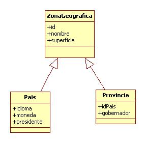
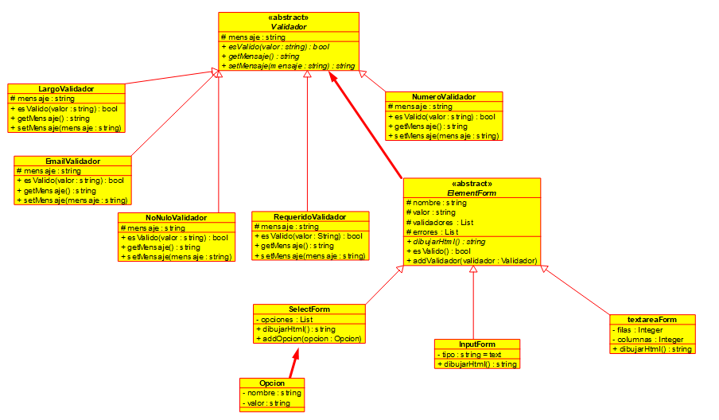

[](img/java.png "java logo")


# java


### Sobre carga de metodos

¿Que es la sobrecarga?

- La sobrecarga se refiere a la posibilidad de tener dos o más métodos con el mismo nombre pero con funcionalidad diferente!

**Ejemplo**

```java

//Entradas int 
int sumar(int a, int b){
    return a+b;
}
int sumar(int a, int b){
    return a+b;
}
//Entradas float 
float sumar(float a, float b){
    return a+b;
}
//Entradas int y float 
float sumar(int a, float b){
    return (float)a+b;
}
//Entradas float e int 
float sumar(float a, int b){
    return a+(float)b;
}

```
- Pasa a ser:

```java
public class Calculadora(){
    private Calculadora(){}

    public static int sumar(int... varargs){
        int total = 0;
        for( int i: varargs){
            total += i;
        }
        return total;
    }

}
```

- Para restringir la instancia convertimos los métodos de tipo `static` y el constructor de tipo  `private`, des ta forma podemos imporita de la siguiente manera todos los metodos.

```java
import static com.arthe.sobrecarga.Calculadora.*;

System.out.println("Sumar int : " + sumar(3, 2 ));
System.out.println("Sumar int : " + sumar(3, 2, 5, 4, 1));
```

### Herencia 

¿Qué es la herencia? 

- Es una relación de parentesco entre dos clases, una es padre de la otra, una es hija de la otra!. 

Características

- Es el mecanismo de la programación orientada a objetos para implementar relaciones de jerarquía de clases.
- Una subclase hereda el estado y el comportamiento de todos sus ancestros.
- Es una de las bases de reutilización de código y polimorfismo.
- Támbien es un principio fundamental de la POO.

Parentesco entre **Clases**

- No puede existir herencia si no existe alguna relación familiar entre ambas clases!

**Ejemplo**

```java
class Persona{...}
class Profesor extends Persona{...}
class Director extends Persona{...}
class Alumno extends Persona{...}
class AlumnoInternacional extends Alumno{...}

class FiguraGeometricas {...}
class Cuadrado extends FigurasGeometricas {...}
class Triangulo extends FigurasGeometricas {...}

```
- El termino superclase se refiere a la clase que es el ancestro más directo, así como a todas las clases ascendentes 

Relación de *Generalización*.
- En UML es una flecha continua que va desde la clase hija hasta la clase padre, similar a la realcion de asociación, pero con la diferencia que termina con una punta en fomra de triángulo.
- Es una flecha blanca que sale el triángulo de la clase padre apuntando a el padre e extendiendo la linea al hijo. //Lo que entiendo


[](img/herencia.jpg "Herencia Generalización") 
Class Persona
|                    Persona                |       
| ------------------------------------------|       
| - nombre: String                          |       
| - apellido: String                        |
| - email: String                           |
| ------------------------------------------|
| +Persona(nombre:String, apellido:String)  |
| +getNombre(): String                      |
| +getApellido(): String                    |
| +getEmail(): String                       |
| +setNombre(nombre: String): void          |
| +setApellido(apellido: String): void      |
| +setEmail(email: String): void            |             

Class Alumno
|                            Alumno                          |       
| -----------------------------------------------------------|       
| - promedio: double                                         |       
| - institucion: String                                      |
| -----------------------------------------------------------|
| +Alumno(nombre:String, apellido:String, promedio: double)  |
| +getPromedio(): double                                     |
| +getInstitución(): String                                  |
| +setPromedio(promedio: double): void                       |
| +setInstitución(institucion: String): void                 |


Hay dos formas de herencia
- Hay dos formas distintas para el proceso de creación de jerarquías de clases o herencia: 
    - Generalización
    - Especialización: Open close

- De alumno y profesor se repiten atributos como, nombre apellido metodos getter and setter a Persona.

- Constructor y la parabra **super** 
```java

//Clase padre
public class Persona{
    private String nombre;
    private String apellido;

    public Persona(String nombre, String apellido){
        this.nombre = nombre;
        this.apellido = apellido;
    }
}

//Clase hija
class Alumno extends Persona{
    private double promedio;
    public Alumno(String nombre, String apellido, double){
        super(nombre, apellido); 
        this.promedio = promedio;  
    }
}

//Implementación
public class EjemploHerencia{
    public static void main(String[] args){
        Alumno a = new Alumno("Argeo", "Guzman", 7);
    }
}

```

Sobreescritura de métodos 
* Otra caracteristicas de la herencia es poder sobre escribir un método que heredamos del padre, se puede redefiniendo en la clase hija un método con el mismo nombre:
```java
//Padre
public class Persona{
    [...]
    public void metodoDelPadre(){
        //hacer algo importate.
    }
}

//Hija
public class Alumno extends Persona{
    [...]
    @Override
    public void metodoDelPadre(){
        [...]
    }
}

```
* Si quisiéramos usar el comportamiento origina y solo modificar parte en la clase hija, deberíamos hacer lo mismo que vimos anteriormente en el constructor, invocando desde super
```java
public class Alumno extends Persona{
    [...]
    @Override
    public void metodoDelPadre(){
        super.metodoDelPadre();
        [...]
    }
}
```
* Si quisiéramos reusar el toString() del padre lo invocariamos con super:
```java
//Padre
public class Persona{
    [...]
    @Override
    public String toString(){
        return this.nombre + " " + this.apellido;
    }
}
//Hija
public class Alumno extends Persona {
    [...]
    @Override
    public String toString(){
        return super.toString() + ", promedio: " + this.promedio;
    }
} 
```

Restringir la herencia y sobreescritura de métodos
* Para impedir la herencia usamos la palabra final:
```java
//Esta clase no puede tener herencia 
//Modificador final
final public class Persona{ 
    [...]
}
```
* Impedir la sobreescritura de un método que puede ser heredado
```java
public class Persona{
    [...]
    final public void metodoDelPadre(){
        //Hacer algo importante
    }
}
```
### ¿Qué es control de tipos?

### Final 
- Con la palabra **final** podemos notar que 

## Clases Abstractas

#### ¿Qué es una clase abstracta?
- Es una clase que representa un concepto genérico o conceptual y como tal, no debe ser ejemplarizada!

#### Concepto

- Es cuando tenemos una jerarquía de clases en que algún comportamiento está presente en todas ellas pero se materializa de formas distintas en cada una.

- El modificador abstract declara que la clase es una clase abstracta.

- Una clase abstracta podría contener métodos abstractos (métodos sin implementanción).

- Una clase abstracta esta diseñada para ser una superclase y no puede ejemplarizarse.

Ejemplo : Clase abstracta

```java
abstract public class Persona {
    protected Integer id;
    protected String nombre;
    protected String apellido;
    protected String email;
    protected Date fechaRegisttro;

    abstract public void registrar();
    abstract public void modificar();
    abstract public void eliminar();
}
```

```java
abstract public class ElementoForm {
    private String tipo;
    private String valor;
    private String nombre;

    abstract public void dibujarHtml();
}
```

```java
abstract public class FiguraGeometrica {
    abstract public void area();
    abstract public void perimetro();
    abstract public void dibujar();
}
```

```java
abstract public class Mamifero {
    private String habitat;
    private float peso;
    private String color;

    abstract public void hacerRuido();
    abstract public void comer();
    abstract public void dormir();
    abstract public void mover();
}
```

- API de librerias.

[](img/herencia.jpg "Herencia Generalización") 

## ¿Qué es una interface?

- Una interfaz es una colección de métodos abstractos (sin implementar) y de valores constantes que puede realizar un objeto determinado.

#### Concepto

- Una interface es como una clase abstracta pero no permite que ninguno de sus métodos este implementado.

- Captura similitudes entre clases no relacionadas sin forzar una relación entre ellas

- Es decir definen comportamientos que una o varias clases necesitan implementar

- Es un tipo de dato de referencia, puede utilizarse como tipo de dato del objeto (argumento de métodos y una declaración de variable).

##### Diseño orientado a las interfaces

- En java, las interfaces permiten pasas del estilo de diseño "orientado a la implementación" a uno "orientado a la interfaz".
- Donde todas las clases acceden a servicios a través de interfaces que son implementadas por clases concretas.
- Y al no depender de clases concretas (solo de entidades abstractas) nuestro diseño será más reutilizable.

Ejemplo de : Interfaces

```java
public interface Imprimible {
    public void imprimir();
}
```

Clases que implementan interfaces
```java
public class Curriculum implements Imprimible {
    @Override
    public void imprimir(){
        //imprimiendo el CV
    }
}
```

```java
public class Foto implements Imprimible {
    @Override
    public void imprimir(){
        //Imprimiendo una Foto
    }
}
```

##### Herencia múltiple a nivel de interfaces

```java
public interface IPuedeSaltar{
    public void saltar();
}
public interface IPuedeCorrer{
    public void correr();
}
public interface IPuedeNadar{
    public void nada();
}

public class Perro implements IPuedeSaltar, IPuedeCorrer, IPuedeNadar{
    @Override
    public void saltar(){ 
        //salta
    }
    @Override 
    public void correr(){
        //corre
    }
    @Override
    public void nadar(){
        //nada
    } 
}
```
